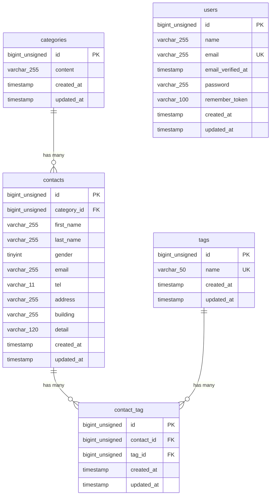

# COACHTECH お問い合せアプリ

お客様からのお問い合せを受信し、管理できるアプリ。
お問い合せでは、カテゴリーやタグを選択でき、タグは管理者がお問い合せ一覧ページで追加・削除・編集できる。

## 作成者

宮本　歩優

## 使用技術

- Laravel Framework 10.50.2
- PHP 8.5.9
- mysql 8.4
- tailwindcss 3.4.19

## ER図



## 開発環境URL

http://localhost

## 動作環境

Docker Desktopがインストールされたパソコン

## 環境構築手順

1. **リポジトリをクローン**

    ```bash
    git clone https://github.com/Ayuu-miyamoto/contact-form-app.git
    ```
2. **プロジェクトディレクトリに移動**
    ```bash
    cd contact-form-app
    ```

3. **.envファイルの準備**
    ```bash
    cp .env.example .env
    ```

4. **Composer依存パッケージのインストール**
    ```bash
    docker run --rm \
    -u "$(id -u):$(id -g)" \
    -v "$(pwd):/var/www/html" \
    -w /var/www/html \
    -e COMPOSER_CACHE_DIR=/tmp/composer_cache \
    laravelsail/php82-composer:latest \
    composer install --ignore-platform-reqs
    ```

5. **Laravel Sailの起動**
    ```bash
    ./vendor/bin/sail up -d
    ```

6. **アプリケーションキーの生成**
    ```bash
    ./vendor/bin/sail artisan key:generate
    ```

7. **データベースのマイグレーションと初期データ投入**
    ```bash
    ./vendor/bin/sail artisan migrate --seed
    ```

8. **フロントエンドのビルド**
    ```bash
    ./vendor/bin/sail npm install

    ./vendor/bin/sail npm run dev
    ```
    
9. **アプリケーションへのアクセス**

    お問い合せ入力フォーム
    
    http://localhost

    管理画面ログインページ

    http://localhost/loginß
    
## テスト実行

    ○○○○○○ ○○○○○○ ○○○○○○ ○○○○○○ ○○○○○○
    ○○○○○○ ○○○○○○ ○○○○○○ ○○○○○○ ○○○○○○

## 機能一覧

- お問い合わせフォーム入力ページ
- お問い合わせフォーム確認ページ
- サンクスページ

- 管理者登録画面
- ログイン画面
- 管理画面（一覧）
- タグ編集ページ
- お問い合わせ詳細ページ
- ログアウト
- 公開API


## APIエンドポイント一覧

○○○○○○ ○○○○○○ ○○○○○○ ○○○○○○ ○○○○○○ ○○○○○○ ○○○○○○ ○○○○○○ ○○○○○○

| HTTPメソッド | URI | 概要 |
|---|---|---|
| GET | /○○○○○○/○○○○○○/○○○○○○ | ○○○○○○ |
| GET | /○○○○○○/○○○○○○/○○○○○○ | ○○○○○○ |
| GET | /○○○○○○/○○○○○○/○○○○○○ | ○○○○○○ |
| GET | /○○○○○○/○○○○○○/○○○○○○ | ○○○○○○ |
| GET | /○○○○○○/○○○○○○/○○○○○○ | ○○○○○○ |